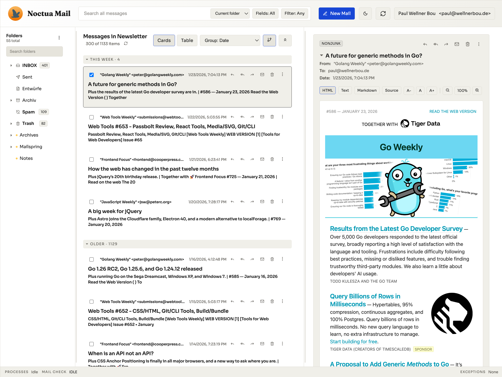

# Noctua Mail

A web-based mail client built with Bun, TypeScript, and Next.js. Noctua Mail supports IMAP/SMTP, fast search, threaded conversations, multiple accounts, and a polished three-pane UI with dark mode.



## Features

- IMAP sync (folders + messages), SMTP support
- Multiple accounts with account settings UI
- Three-pane layout: folders, message list, message view
- Threaded conversations with grouping and collapse/expand
- Full-text search with field filtering and `from:` prefix
- HTML, Text, Markdown, and Source views for messages
- Attachments (inline + downloadable)
- Responsive layout with resizable panes and independent scrolling
- Dark mode
- Per-message text scaling
- User authentication with IMAP only (no separate user credentials)

## Tech stack

- Bun + Next.js (App Router)
- TypeScript
- SQLite (bun:sqlite) for persistence + FTS5

## Getting started

```bash
bun install
bun run dev
```

Open `http://localhost:3654`.

## Operations

- Local data is stored in `.data/` (SQLite db, sources, attachments).
- Attachments and sources are stored separately for performance.
- IMAP/SMTP credential storage mode:
  - `IMAP_CREDENTIALS_STORAGE` (`cookie` | `db` | `both`, default `both`).
    - `cookie`: credentials only in sealed session cookie.
    - `db`: credentials only in encrypted DB.
    - `both`: credentials in cookie + encrypted DB.
  - `IMAP_SECRET_KEY` (32‑byte key; hex recommended). Required to encrypt/decrypt stored DB passwords.
- Authentication:
  - `AUTH_ENABLED` (default `true`) gates the app behind a login/signup (invite) flow.
  - `SESSION_SEAL_KEY` (32‑byte key) seals the session cookie for the current session.

## Project structure

- `app/` – UI and API routes
- `lib/` – IMAP/SMTP, storage, search, db
- `public/` – static assets

## License

This project is licensed under the [Elastic License 2.0](LICENSE).

You are free to use, modify, and distribute this software. You can host it yourself, even for commercial purposes.
However, you may **not** provide the software to third parties as a managed cloud service (SaaS).
