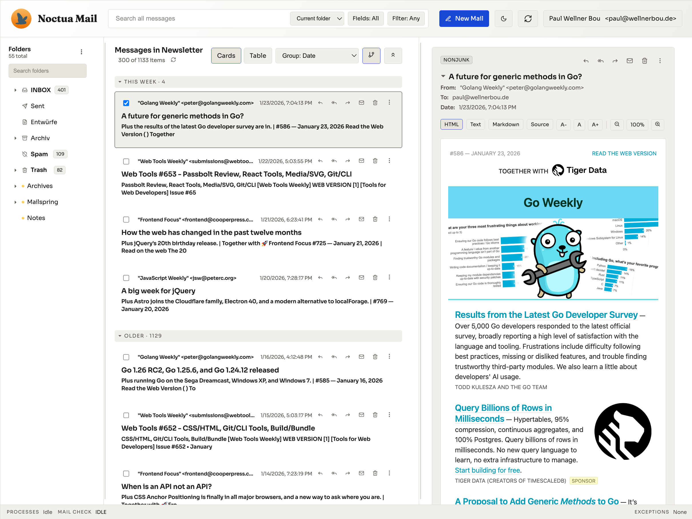

# 🦉 Noctua Mail


A fast web-based mail client (IMAP/SMTP) built with Bun, TypeScript, and Next.js.

I am trying to combine the advantages of GMail, Thunderbird and Spark, step by step, keeping full IMAP compatibility using IMAP (custom) properties and relying on standard email headers for all features.

A working WebCal integration is planned, I need it, and it will be the first thing I will be working on after the mail client is stable and usable for daily use.



## ✨ Key Features

### 🧠 Adaptive Email Categorization
Automatic message categorization into **Newsletter**, **Notification**, and **Transactional** using a hybrid approach:
- **Heuristic classifier** based on robust mail headers and content signals
- **Per-account online learning** from manual category actions (set/change/clear)
- **Manual override controls** directly in the message action menu
- **Debug visibility** for learned model state and feedback events in Account Settings → Categorization

See `doc/CATEGORIZATION.md` for technical details.

### 🔗 Related Mails
Discover connections across your inbox with related mails. When viewing any email, instantly find related messages based on:
- **Subject similarity** – Find conversations on similar topics
- **Sender/Recipient overlap** – Track communications with the same people
- **Thread references** – Follow email chains using In-Reply-To and References headers
- **Calendar invite UID matches** – Find invitation updates/cancellations tied to the same event

Access via the "Show related" option in the message action menu or search with `related:<mail-id>`. For calendar invites, use `invite:<uid>` (or `event:<uid>`) to find related invitation mails.

### 🧵 Thread View Across Folders
Unified conversation threading that works **across all folders**. Whether emails are in Inbox, Sent, or any other folder, Noctua Mail intelligently groups them into cohesive threads. Collapse and expand conversations with ease, maintaining context no matter where messages are stored.

### 🎯 Workflow Views
Built-in virtual folders keep triage fast and actionable:
- **Focused** – Prioritized inbox view for what matters now
- **Action Queue** – Messages that are flagged, marked TODO, or marked done
- **Invite Deck** – Calendar invitation-focused view with unread/total counters

### ⏰ Calendar Invite Reminders
Schedule reminders directly from ICS invites and get desktop/system notifications at the right time:
- **Per-invite reminder controls** – Schedule, modify, and delete reminders from the invite preview
- **Recurring invite support** – Reminder timing follows recurring event rules (`RRULE` + exceptions)
- **Automatic invite update handling** – Reminder records are updated/removed when invite updates or cancellations arrive
- **Offline-aware delivery** – PWA/service worker delivery with local cache and due-lookback handling

### ✍️ Markdown Composing
Write emails in **Markdown** with a dedicated compose mode and send them as fully rendered HTML (with plain-text fallback), while preserving clean markdown source in drafts.

### 🔐 IMAP-Only Authentication
Simple, secure authentication using your existing IMAP credentials. No separate user accounts and no stored passwords to manage – just connect with your email server credentials and start using Noctua Mail immediately.

---

## 🚀 Features

### 📧 Email Management
- **IMAP sync** – Full folder and message synchronization
- **SMTP support** – Send and reply to emails
- **Multiple accounts** – Manage several email accounts
- **Rich message viewing** – HTML, Text, Markdown, and Source views
- **Attachments** – Inline display and downloadable files
- **Calendar invites** – Display ICS details (full calendar support in progress 📅)
- **Calendar reminders** – Schedule notifications for invite events, including recurring meetings
- **Automatic invite updates** – Apply invite changes/cancellations to existing reminder data

### 🎨 UI
- **Three-pane layout** – Folders, message list, and message view
- **Dark mode** 🌙 – Easy on the eyes
- **Installable PWA** 📱 – Install as a native app on desktop
- **OS notifications** 🔔 – Get notified of new emails
- **Responsive design** – Resizable panes with independent scrolling
- **Per-message text scaling** – Adjust font size (or zoom for HTML) for individual messages
- **Virtualized lists** ⚡ – Blazing-fast display of thousands of emails
- **Workflow folders** – Focused, Action Queue, and Invite Deck virtual views

### 🔍 Powerful Search
- **Full-text search** powered by SQLite FTS5
- **Field filtering** – Search by `from:` (even `from:me`), `to:`, `subject:`, and more
- **Related mail search** – Find connected conversations with `related:<mail-id>`
- **Invitation mail search** – Find invite-related mails via `invite:<uid>` (or `event:<uid>`)
- **Search across all folders** – Or narrow down to specific folders

### 💬 Smart Threading
- **Intelligent conversation grouping** – Automatically thread related messages
- **Cross-folder threading** – See complete conversations regardless of folder location
- **Collapse/expand threads** – Focus on what matters
- **Visual thread indicators** – Clear hierarchy and relationships

---

## 🛠️ Tech Stack

- **Runtime** – [Bun](https://bun.sh)
- **Framework** – [Next.js](https://nextjs.org) (App Router)
- **Language** – TypeScript
- **UI** – [Radix UI](https://www.radix-ui.com/themes) + [Lucide Icons](https://lucide.dev)
- **Email** – [ImapFlow](https://imapflow.com) + [Nodemailer](https://nodemailer.com)
- **Database** – SQLite (bun:sqlite) with FTS5 full-text search
- **Rich Text** – [Lexical](https://lexical.dev)

---

## 🏃 Getting Started

### Prerequisites
- [Bun](https://bun.sh) runtime installed

### Installation

```bash
bun install
bun run dev
```

Open [http://localhost:3654](http://localhost:3654) in your browser.

### Testing

Run all tests:

```bash
bun test
```

Run only the message list behavior regression tests:

```bash
bun test app/components/mailclient/messagelist/listBehavior.test.ts
```

---

## ⚙️ Configuration

### Data Storage
Local data is stored in `.data/` directory:
- SQLite database
- Message sources
- Attachments (stored separately for performance)

### Environment Variables

#### IMAP Credentials Storage
Configure how IMAP/SMTP credentials are stored:

```bash
IMAP_CREDENTIALS_STORAGE=both  # Options: cookie | db | both (default: both)
```

- **`cookie`** – Credentials only in sealed session cookie
- **`db`** – Credentials only in encrypted database
- **`both`** – Credentials in both cookie and encrypted database (recommended)

```bash
IMAP_SECRET_KEY=<32-byte-hex-key>  # Required for DB encryption
```

#### Authentication
Control access to the application:

```bash
SESSION_SEAL_KEY=<32-byte-hex-key>  # Required for session cookie sealing
```

### Data Directory
Customize the data directory location:

```bash
NOCTUA_DATA_DIR=../noctua-data  # Default: .data/
```

---

## ℹ️ Current Limitations

- **Desktop-optimized** – While installable as a PWA, the UI is currently optimized for desktop use. Mails for mobile devices are better managed in a real app instead of a browser based webmail client. Mobile support will be improved over time, but it is not the primary focus.

---

## 📄 License

This project is licensed under the [Elastic License 2.0](LICENSE).

**You are free to:**
- ✅ Use, modify, and distribute this software
- ✅ Host it yourself for personal or commercial use

**You may not:**
- ❌ Provide the software to third parties as a managed cloud service (SaaS)

---

## 🤝 Contributing

Contributions are welcome! Feel free to open issues or submit pull requests.

The code is primarily written by AI agents (Claude, Codex, GitHub Copilot, Antigravity). I don't strive for a clean code base, but a working product. I do welcome improvements and optimizations.

---

Built with ❤️ and 🤖 by [Paul Wellner Bou](https://paul.wellnerbou.de)
